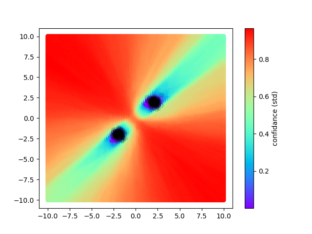
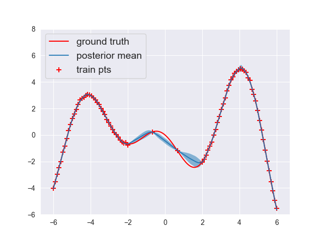

# particle-based-vi_ood
Implementation of particle based VI methods for OOD detection

## Methods

So far I have implemented Stein Variational Gradient Descent. An ensemble method that minimizes the KL divergence between the ensemble, and the distribution of interest. 

Where we want uncertainty in model predictions, we can initialize an ensemble of network, and train them with SVGD to get models with diverse predictive distributions -- especially concerning outlier data. 

## Models

I have made this repo so in principle any model can be used. Really complicated models with lots of parameters that are not part of linear/conv layers are kind of uncharted territory so your milage may vary. 

Looking at `lenet.py`, a simple classifier made for MNIST as an exaple. Just define some model the normal way and it can be used with svgd. 

For simpler tasks, see `simple_models.py` where I have defined small regression and classification neural networks. These simple models are meant to test the ability of models trained with svgd, to reveal the data distribution through their predictions. For example, in a 2 class classification problem where the data is drawn from two modes, the ensemble members should agree with high confidence on the data, and disagree on the outlier data. A plot of the disagreement (variance) in the predictions should reveal the data density itself. 

In the case of 2 class classification functions

In the case of 1D regression functions

## Training

* `parvi_train_simple.py` : train svgd on simple 2/4 class classification settings. Or else train with 1D regression functions. In both experiments plots are output to `plots/` directory. 
* `ensemble_train_simple.py` : train ensemble on simple datasets

* `parvi_train.py` and `ensemble_train.py` train svgd and standard ensembles respectively on MNIST/CIFAR-10 datasets. These files allow for densenet121, Lenet, or ResNet architetures. Each model has a corresponding definition file

`parvi_train` reports the AUC of predictions on the outlier dataset. `datagen.py` defines the datasets and the classes that correspond to "outliers". 

## Coming Features. 

* ParVI methods GFSF and fisher neural sampler
* amortized ParVI methods of SVGD and GFSF
* My new method GPVI (might take a while)

## Contributing. 

* Please make a new branch and make a pull request to add features. 
* If you have something that works, please consider making a pull request to add to the repo. It is only possible to ensure correct research if people double check code, and its easily readable. 
